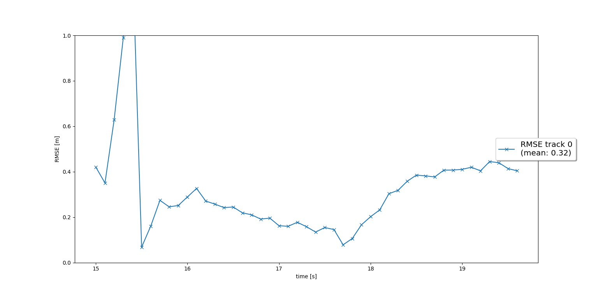
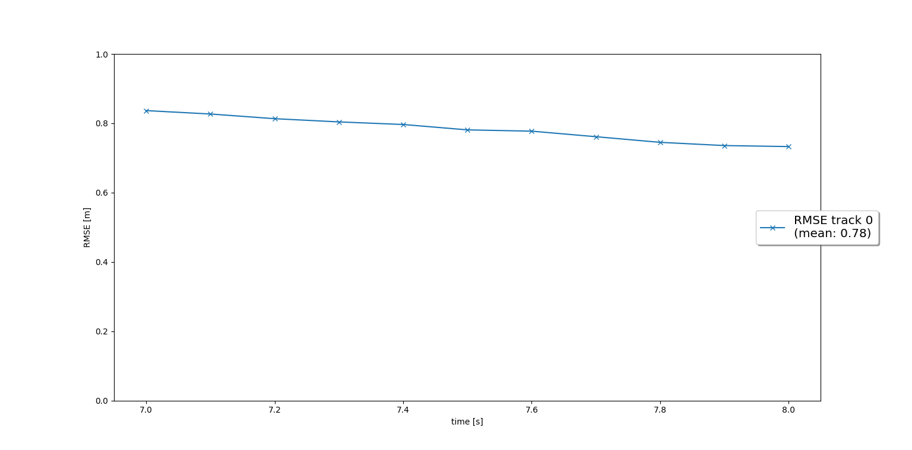
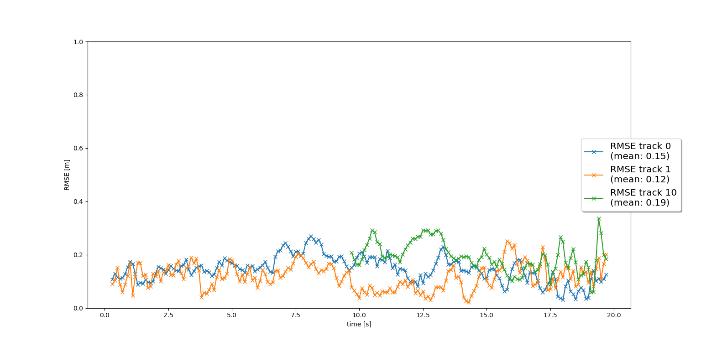
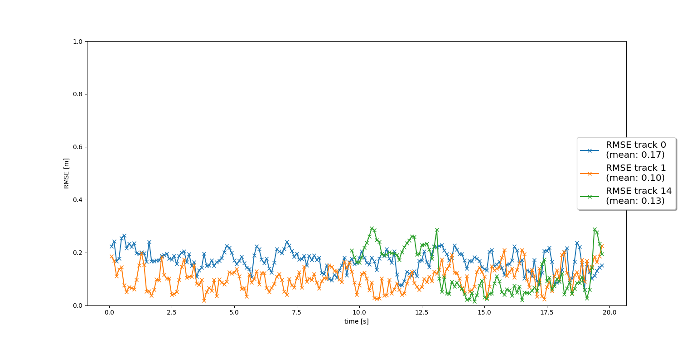

# Writeup: Track 3D-Objects Over Time

### 1. Write a short recap of the four tracking steps and what you implemented there (filter, track management, association, camera fusion). Which results did you achieve? Which part of the project was most difficult for you to complete, and why?

#### Filter
In this step I implemented an EKF (extended Kalman filter), comprising of the system matrix `F`, the process noise covariance `Q`, the residual `gamma`, the covariance of the residual `S` and the `update()` and `predict()` functions for predicting the next state x and to update state x after a new measurement, respectively. Both functions provide also an update for the estimation error covariance `P`.

With this EKF it is possibel to track a singel real-world target with lidar measurement input over time. The following image shows the resulting RMSE (root mean squared error) plot.

#### Track Management:
In this step I implemented the track management to initialize and delete tracks, and to set a track state and a track score.

First, the intialization of tracks had to be implemented in class `Track`. This means setting the initial values for a track's attributes: x (state coordinates), P (covariance), state and score. By calculating x the sensor's coordinates have to be transformed to vehicle coordinates.

The function `manage_tracks` in class `Trackmanagement` loops over all unassigned tracks and checks whether a track is within the field of view of the respective sensor. Depending on the track's state, i.e. _initialized_, _tentative_ or _confirmed_, the track will be deleted if its score is below a specified threshold or `P` is to big. For all unassigned lidar measurements a new track is initialized.

At this point, with the EKF and the track management it was possible to see how a new track is initialized if a uninitialized measurement occurs, the state of the track changes over time, and the track is deleted after it vanishes from the visible range. 

The following RMSE plot shows a single track without track losses in between.

#### Association:
In this step I implemented a single nearest neigbor data association to associate measurements to tracks.

In the `Association` class I implemented several functions:

* `associate()`: Incorporate the actual association matrix based on Mahalanobis distances for all tracks in `track_list` and measurements in `meas_list`.
* `MHD()`and `gating()`: In these functions the Mahalanobis distance and a gating mechanism to reduce association complexity was implemented. 
* `get_closest_track_and_meas()`: The minimum entry in `association_matrix` had to be found and the corresponding column and row to be deleted from the matrix. Additionally, the entry had to be removed from both lists `unassigned_tracks` and `unassigned_meas`. Depending on whether an association was found or not, the association pair of track and measurement or `numpy.nan` had to be returned.

Having implemented this class, multi target tracking became possible. The following RMSE plot shows three tracks, two of them from the beginning to the end without track losses in between.

#### Camera Fusion:
In final step I implemented a nonlinear camera measurement model and completed the sensor fusion module for camera-lidar fusion.

In class `Sensor` (contained in file `measurements.py`) I implemented the function `in_fov()` to check if the input state vector `x` of an object can be seen by the sensor. Furthermore, I implemented the function `get_hx()` with the non-linear camera function `h()`. Finally, function `generate_measurement()`was extended to include camera measurements.

In class `Measurement` I completed the `__init__()` method to initialize camera measurements including the measurement vector `z` and the measurement noise covariance matrix `R`. 

The RMSE plot below shows three confirmed tracks. Two of the tracks are tracked from beginning to end of the sequence (0s - 20s) without track loss. The mean RMSE for these two tracks is below 0.20.

Completing the final step was most difficult for me as I had to remember how to cope with non linearities of the camera model.

### 2. Do you see any benefits in camera-lidar fusion compared to lidar-only tracking (in theory and in your concrete results)?
In theory, more measurements from different sensors should help to increase the confidence regarding the existence of an object. Thus, the fusion of lidar and camera measurements should reduce the amount of ghost tracks or/and their time of existence.

Comparing the BEV and camera movies, these theoretical expectations are confirmed which is really amazing!

### 3. Which challenges will a sensor fusion system face in real-life scenarios? Did you see any of these challenges in the project?
One major challenge a sensor fusion system might face in real-life senarios is the occlusion of objects, temporarily or long-lasting. This could lead to an unexpected behaviour of the vehicle, e.g. emergency brakes due to the sudden emergence of other traffic participants on the road, or it may even cause accidents.

Another problem could be the emergence of ghost tracks due to wrong measurements which could also lead to an seemingly erratic behavior of the vehicle, e.g. not starting up after traffic lights went to green as the car senses a ghost-vehicle standing right in front of it.

In the project I could at least see that there were some ground truth objects which were not detected by the sensors as they were out of reach, e.g. vehicles behind a wall.

### 4. Can you think of ways to improve your tracking results in the future?
Tracking results can be improved by several measures, for example by incorporating additional senors. Another way could be to select a better computer vision model with improved precision/recall performance.

But the most obvious approach is to fine tune existing parameters, some of them are in `params.py`, or to implement a more advanced data association (GNN, JPDA), among others, as suggested at the end of the project specification.

