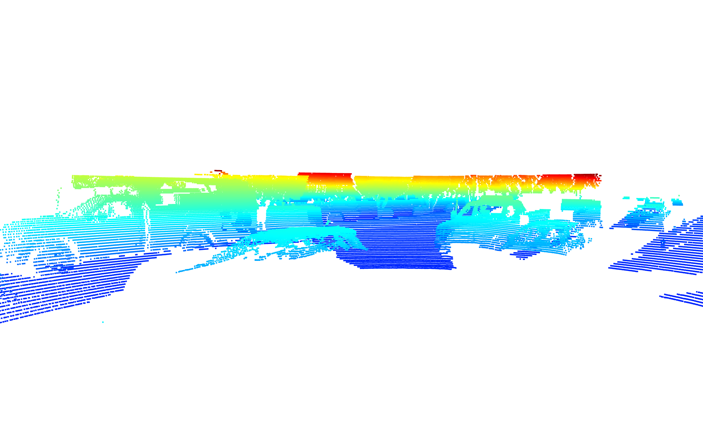
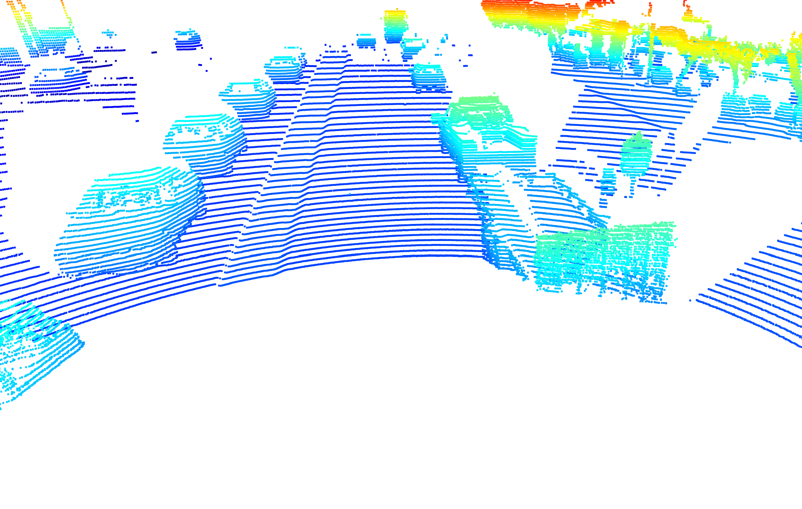

# Project 3D-Object Detection

## Point-Cloud inspections 
The following ten example point-clouds show vehicles with varying degrees of visibility.

  
  

  
  

  
  

  
  

  
  

## Stable features on most vehicles
As can be seen from the examples displayed above, despite their varying degrees of visibility, some features appear rather stable on most vehicles.

* Wheels: If not cut away, a vehicle's wheels or parts of them can be detected.
* Shape: The shape of a vehicle can be seen in most cases, e.g. whether the vehicle is pick-up, station wagon, passenger car,or if it draws a trailer.
* Windows: In many cases a vehicle's windows can be identified.
* Other parts: From the front, side mirrows can be detected easily, and if available other parts like an antenna can be detected as well. Sometimes a vehicle's lights are visible but less often as the other parts.

The range image below underpins the findings, especially the visibility of a vehicle's lights, windows and shape.

